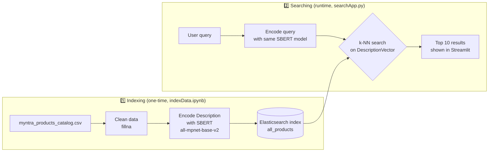
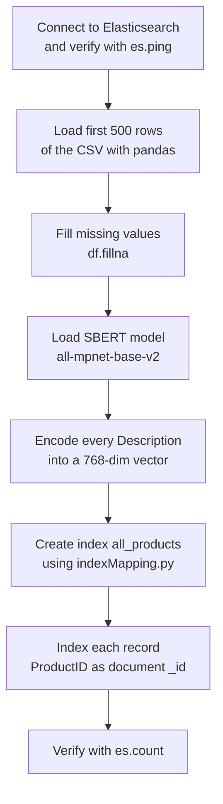
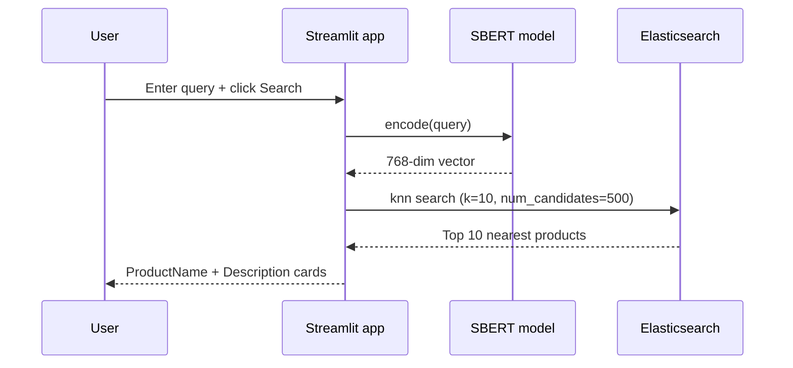

# Semantic Search with BERT Vector Model

A semantic (meaning-based) product search engine for the [Myntra fashion catalog](https://www.kaggle.com/datasets/djagatiya/myntra-fashion-product-dataset), built with **Sentence-BERT embeddings**, **Elasticsearch k-NN vector search**, and a **Streamlit** UI.

Unlike keyword search, this understands *intent* — searching "something warm for winter" can return jackets and sweaters even if those exact words never appear in the product description.

---

## How It Works



The core idea: product descriptions and user queries are converted into **768-dimensional vectors** by the same BERT model. Elasticsearch then finds the products whose vectors are *closest* (L2 distance) to the query vector — closest in vector space ≈ closest in meaning.

---

## Project Structure

| File | Purpose |
|---|---|
| `indexData.ipynb` | Ingestion pipeline: loads CSV → generates embeddings → creates & populates the Elasticsearch index |
| `indexMapping.py` | Elasticsearch index schema (field types + `dense_vector` config) |
| `searchApp.py` | Streamlit web app that performs live semantic search |
| `myntra_products_catalog.csv` | Dataset (~12,700 products; the notebook indexes the first 500) |

---

## Prerequisites

- Python 3.9+
- An [Elastic Cloud](https://www.elastic.co/cloud) deployment (or a local Elasticsearch 8.x with vector search enabled)
- Python packages:

```bash
pip install elasticsearch sentence-transformers streamlit pandas
```

---

## Setup & Usage

### Step 1 — Configure Elasticsearch credentials

> ⚠️ **Never hardcode credentials in source files.** Use environment variables:

```bash
export ES_URL="https://<your-deployment>.elastic-cloud.com:443"
export ES_USER="elastic"
export ES_PASSWORD="<your-password>"
```

And in Python:

```python
import os
from elasticsearch import Elasticsearch

es = Elasticsearch(
    os.environ["ES_URL"],
    basic_auth=(os.environ["ES_USER"], os.environ["ES_PASSWORD"]),
)
```

### Step 2 — Build the index (run once)

Open and run `indexData.ipynb` top to bottom:



The first run downloads the SBERT model (~420 MB) and encoding 500 descriptions takes a few minutes on CPU.

### Step 3 — Run the search app

```bash
streamlit run searchApp.py
```

Open the URL Streamlit prints (default `http://localhost:8501`), type a query like *"black bag for travel"*, and hit **Search**.



---

## Index Schema (`indexMapping.py`)

All catalog fields are stored as `text`/`long`, plus the vector field that powers the search:

```python
"DescriptionVector": {
    "type": "dense_vector",
    "dims": 768,          # output size of all-mpnet-base-v2
    "index": True,
    "similarity": "l2_norm"
}
```

Key search parameters in `searchApp.py`:

- `k: 10` — number of nearest neighbours returned
- `num_candidates: 500` — candidates considered per shard (higher = more accurate, slower)

---

## Ideas for Improvement

- Index the full ~12.7k catalog instead of the first 500 rows (batch with the `helpers.bulk` API)
- Load the SBERT model once at app startup (`@st.cache_resource`) instead of on every search
- Show `ProductBrand`, `Price (INR)`, and `PrimaryColor` in results; add filters
- Try `cosine` similarity, which is standard for sentence embeddings
- Hybrid search: combine k-NN with classic BM25 keyword matching

---

## Tech Stack

[Sentence-Transformers](https://www.sbert.net/) (`all-mpnet-base-v2`) · [Elasticsearch 8.x k-NN search](https://www.elastic.co/guide/en/elasticsearch/reference/current/knn-search.html) · [Streamlit](https://streamlit.io/) · pandas
